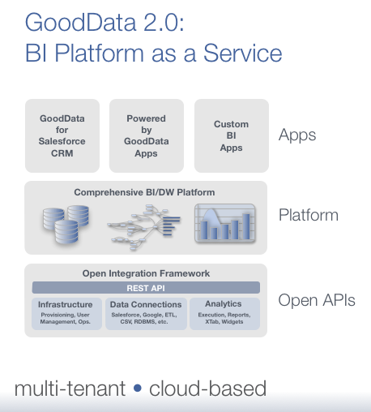

# Limits

<table id="limits">
  <tr>
    <th># of columns</th>
    <td>60 cols / dataset</td>
  </tr>
  <tr>
    <th># of rows</th>
    <td>10^6 rows is fine, 10^7 rows is getting slow, more is bad</td>
  </tr>
  <tr>
    <th>Length of a column</th>
    <td>
      <strong>Attribute:</strong> 128 characters by default, <a href="{{site.root}}/api/maql-ddl.html#performance">extensible</a> to 256 characters 
      <strong>Fact:</strong> DECIMAL(12,2) by default (-10^10..10^10, 2 decimal places), <a href="{{site.root}}/api/maql-ddl.html#performance">extensible</a> to DECIMAL(15,6) (-10^15..10^15, 6 decimal places )
    </td>
  </tr>
</table>
# Product

### What is the GoodData Open Integration Framework?
GoodData's open integration framework are a set of APIs and capabilities that make it easy to manage GoodData projects and users; model and load data, and share reports, dashboards and analytics -- all programmatically using open APIs. This is a critical piece of GoodData's BI Platform as a Service, as outlined in the image below.

### What is the data integration piece?
GoodData is launching new data loading and modeling APIs, scripts, tools and pre-built connectors to make it much easier for you to load and model data in GoodData. This new data integration framework is built atop GoodData's fluid data model which greatly increases the flexibility of any GoodData project. It includes new APIs, a Java Integration Framework, pre-built connectors for Google Analytics, connections with data integration platforms, and documentation.

### Why is it better than what GoodData already has?
GoodData's new data integration framework fully supports our fluid data model which provides unprecedented flexibility in agile BI implementation. It's much easier to bring data into GoodData from many sources and with many methods, and it's easier to create a multi-dimensional data model for analysis. Most important, the fluid data model makes it simple to add or change data sources or models without breaking reports, projects, or dashboards.

### Why is it different/better than other vendor approaches?
GoodData is bringing a level of flexibility in data modeling and loading to the SaaS BI that frankly does not exist today. Flexibility in terms of choice of tooling and integration methods. Flexibility in terms of adding data and changing data models.

### When is the new data integration framework available?
Our new data integration APIs are available today in beta. We will be rolling out the complete functionality in phases over the next 3 months.

### How can I start using it?
GoodData is running an early access program - visit developer.gooddata.com or contact us at support@gooddata.com to apply for the program

### Is this data integration in the cloud? On my premises?
Both options are supported. There are multiple layers in the API that allows for both in-cloud and on-premise execution of the data loading components. For example the on-premise components can be used for loading data sources that are located behind company firewall. The cloud components can be used for loading data from SaaS applications.

### Do you expect me to have existing tools to get started?
No. You can use existing tools (scripting tool, Java IDE or data integration tool like Boomi or SnapLogic) if you want but you are not required to.

### I'm a BI developer, what's in it for me?
GoodData gives you agility first and foremost. Our fluid data model enables you to work at the 'logical data model' level, rapidly iterate on data model and source changes without having to constantly rebuild projects, models, reports or dashboards. The Data Integration APIs make it much easier and more flexible for you to provision, manage projects, and connect to a lot more data sources quicker.

### I'm an IT guy, what's in it for me?
GoodData now supports your existing data integration infrastructure. Allows you to control how data is loaded into GoodData.

### I am a SaaS ISV, what's in it for me?
With GoodData, it's much easier to pre-provision projects for multiple customers and interact programmatically with GoodData. For SaaS providers, data integration is just the start - it's also true of the entire platform - from provisioning and user management through reporting, embedding etc.

# API Internals

### What language is GoodData written in?
It doesn't matter. What matters is that GoodData interface world with RESTful HTTP APIs that can be invoked from many programming language or framework. GoodData provides convenient programming languages wrappers on top of the RESTful HTTP API. These wrappers allow for easy integration with specific 3rd party applications. Initially we 'll support Java. We also aim at Python and other programming languages in the future.

### What language does GoodData API talk?
RESTful HTTP. There is also the lightweight API wrapper in Java described above.

### What languages are supported?
Any on the API level. We have extended support for Java.

### Which one should I use
It's your choice. If you have specific issues, let us know and we can chat about what is right for you.

# Support

### How can I get support?
There are forums on developer.gooddata.com specifically around the new data integration framework. GoodData customers are supported via the standard support channels.

### What is documented? Are there any quick start guides?
quick start guide for loading data and our data modeling language will be made available on developer.gooddata.com.

### Are there pre-built scripts, sample code?
Yes there are some (and plenty on the way) on the developer.gooddata.com.

# Availability & launch?

### When can I use it?
Beta is available today under limited early access program

### What does 'early access' mean? Is it ready for prime time?
While the new APIs and framework are functionally complete, it's beta software. We use them internally, but want to make sure it meets customer requirements first. This is why they are available for early access.

### When will this be in production?
The APIs are already 'in production' but the tools and scripts are still in an early stage. We are scheduling a public launch for later this year.

### How do I decide whether I use this versus the current CSV loader?
Ultimately all GoodData projects will utilize these new data loading/integration APIs. For the time being, if you are considering the new APIs we recommend we talk with you about why these would be better. If you have questions, let us know. Both versions are going to be available in parallel for at least 6 months. The version 1.0 API will be deprecated 3 months after the launch of the 2.0 APIs. The deprecated 1.0 APIs will be available for additional three months. We will release migration utilities that help migration between both versions.

### I created a new project creating the new 2.0 APIs. Can I use the CSV upload wizard?
No. This will be possible in a few releases - most likely around August or September.

# Migration

### I am an existing GoodData customer, how do I use it?
If you are experimenting with GoodData, feel free to use our CSV upload wizard. For new projects, we recommend using the version 2.0 API. Contact us, we will help you with the migration.

### What are the drawbacks of using 1.0 APIs compared to using 2.0 APIs?
Flexibility and performance. The 1.0 APIs aren't fluid. Customers need to rebuild their projects from scratch when the data model changes.

### Do I have to migrate to 2.0 APIs? How long will you keep compatibility with my 1.0 APIs, projects, tools?
Yes. Both versions are going to be available in parallel for at least 6 months. The version 1.0 API will be deprecated 3 months after the launch of the 2.0 APIs. The deprecated 1.0 APIs will be available for additional three months. We will release migration utilities that help migration between both versions.

### Can I use the new 2.0 tools in my existing 1.0 projects?
No. The projects must be migrated to the version 2.0 first.

### Can I migrate my projects? Or will GoodData do it for me?
We will release set of migration tools that will help you to migrate your projects.

### What happens to my existing data loading scripts?
They will work for additional 6 months after the new APIs are launched.

### Do I need to rebuilt my projects (dashboards reports, etc.)
We are working on a migration plan which will be available when we launch commercially
