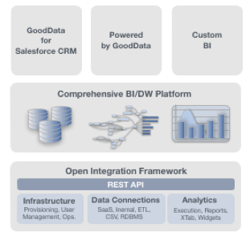

    
    <h1 id="introducing_gooddata_platform_as_a_service">Introducing GoodData Platform as a Service</h1>
    
    
With GoodData Open Integration Framework, it's now easier then ever to have professional BI analytics package integrated in your solution. Gooddata provides a powerful array of tools and APIs to enable you deliver analytics to your users.

    
The GoodData CL utility helps you get started quickly and automate things later.

    
    

        <button onclick='window.open("/start/","_self");' style="line-height: 2em; margin-top: 20px;"><b>Watch</b> a quick-start screencast on using GoodData CL</button>
        <button onclick='window.open("http://www.gooddata.com/technology/gooddata-2-0-launching-soon/","_blank");' style="line-height: 2em; margin-top: 20px;"><b>Join</b> early-access program</button>
    

 

&nbsp;

    <h3>Getting Started</h3>
    <ul>
        <li><a href="https://secure.gooddata.com/registration.html">sign up</a> for a GoodData account</li>
        <li><a href="/start/">watch</a> a short video to get started using GoodData CL</li>
        <li><a href="/download.html">download</a> GoodData CL utility</li>
        <li><a href="/gooddata-cl/examples/">see examples</a> of different integration scenarios</li>
    </ul>

    <h3>More Information</h3>
    <ul>
        <li>see more information about <a href="/download.html">GoodData CL</a></li>
        <li><a href="/api/maql-ddl.html">MAQL API documentation</a> for advanced data modeling</li>
        <li><a href="faq.html">read the FAQ</a> about the new platform</li>
        <li><a href="http://support.gooddata.com/forums/176660-developer-forum">seek help</a> in our Developer Forums</li>
    </ul>

 

&nbsp;

